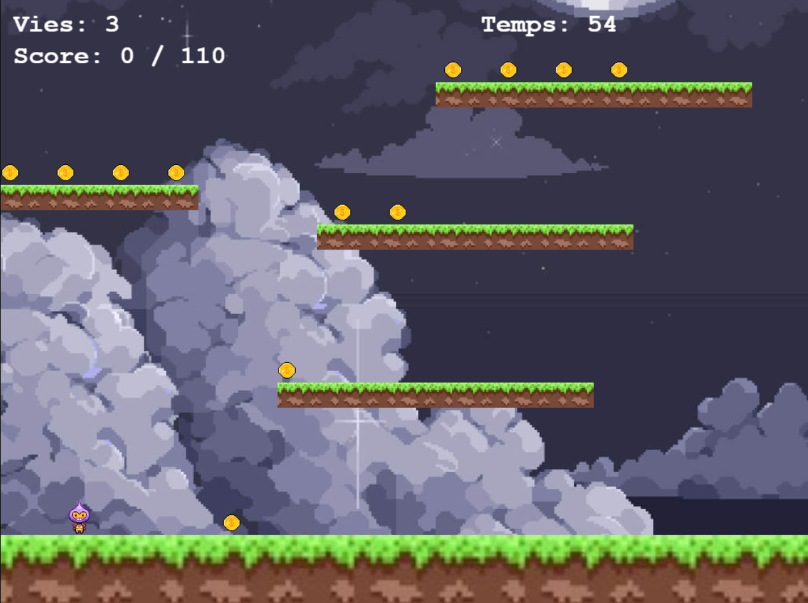

#  GameJam-LaPurRa

**Jouez au jeu directement ici : [Lancer le jeu !](https://kamelotc.github.io/GameJam-LaPurRa/)**

## 📖 Le concept

Vous incarnez un Lapurra (voleur en basque) et vous devez voler un total de 110 pièces en 60 secondes, tout en évitant les bombes.

C'est un jeu pour les personnes qui sont prêtes à jouer longtemps. 
Il n'y a qu'un seul niveau, et il est déjà assez difficile. 
Votre personnage se déplace à la vitesse de la lumière, ce qui peut être aussi bien un avantage qu'un inconvénient. 

Bonne chance !!

## 🎮 Contrôles
* **Flèches directionnelles** : Se déplacer

## 🛠️ Outils utilisés
* **Moteur** : Phaser 3 / Vite
* **Langage** : TypeScript
* **Graphismes** : craftpix.net
* Les graphismes et images sont libres de droits et trouvés sur internet.